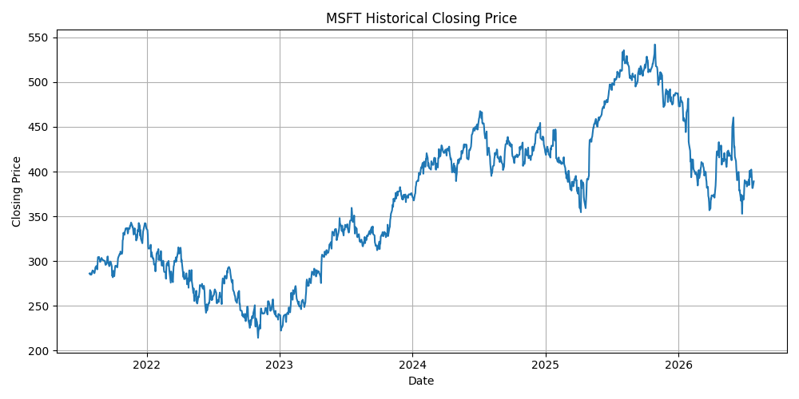
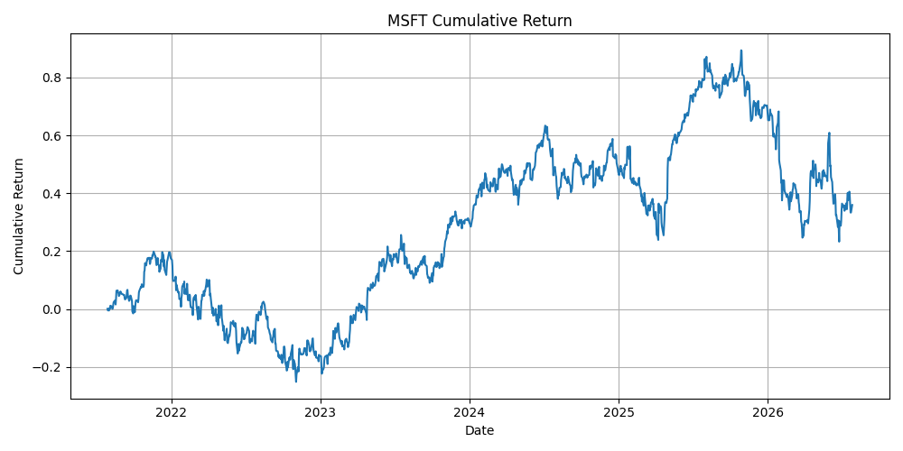
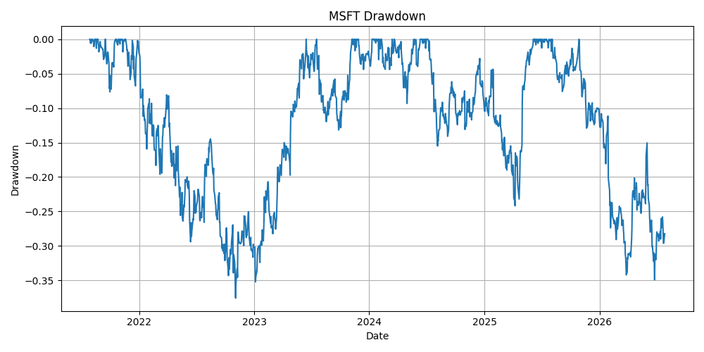

# FinSight

FinSight is a Python-based equity research toolkit that combines financial
statement analysis, valuation, market risk analysis, and explainable investment
insights.

The project demonstrates how public financial and market data can be converted
into structured and decision-useful analysis.

## Planned Features

- Retrieve public financial and stock-market data
- Analyse revenue growth, margins, and profitability
- Calculate financial and valuation ratios
- Measure returns, volatility, and maximum drawdown
- Compare a company with selected peers or market benchmarks
- Generate charts and a concise investment summary
- Extend the analysis with CAPM and regression modelling

## Initial Demonstration

Microsoft Corporation (`MSFT`) will be used as the first demonstration company.

The project will later be designed to accept other stock tickers.

## Technology

- Python
- pandas
- NumPy
- matplotlib
- yfinance
- scikit-learn
- Jupyter Notebook

## Project Structure

```text
FinSight/
├── data/           # Local datasets
├── notebooks/      # Exploratory analysis
├── outputs/        # Generated charts and reports
├── src/            # Reusable Python modules
├── tests/          # Project tests
├── requirements.txt
└── README.md
```

## Case Study Notebook

A complete Microsoft equity-analysis case study is available here:

[View the Microsoft case-study notebook](notebooks/01_msft_case_study.ipynb)

## Example Analysis

The charts below show a five-year analysis of Microsoft Corporation (`MSFT`).

### Historical Closing Price



### Cumulative Return



### Drawdown



## Metrics Produced

FinSight currently calculates:

- Annualized return
- Annualized volatility
- Maximum drawdown
- Sharpe ratio
- Revenue growth
- Net-income growth
- Net-profit margin

Results depend on the selected ticker, analysis period, and latest available public data.

## Testing

FinSight includes automated tests for:

- ticker normalization;
- analysis-period validation;
- invalid-input handling;
- risk-metric output structure;
- missing-column validation.

Run the test suite from the project directory with:

```bash
pytest -q
```

The current test suite contains five automated tests.

## Project Status

FinSight currently supports:

- Historical market-data retrieval
- Interactive ticker and period selection
- Basic stock-price statistics
- Risk and return calculations
- Financial-statement analysis
- Automated price, cumulative-return, and drawdown charts

The next development stages are a documented Microsoft case-study notebook,
benchmark comparison, and automated testing.

## Disclaimer

FinSight is an educational project and does not provide investment advice.
Market and financial data may be delayed, incomplete, or subject to revision.
